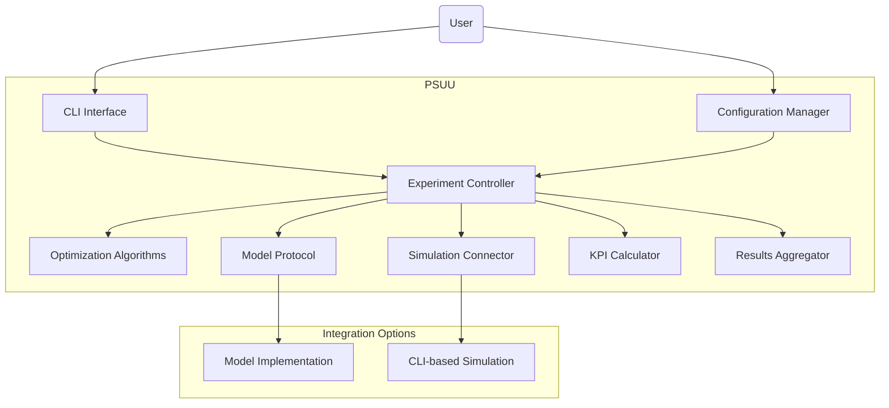
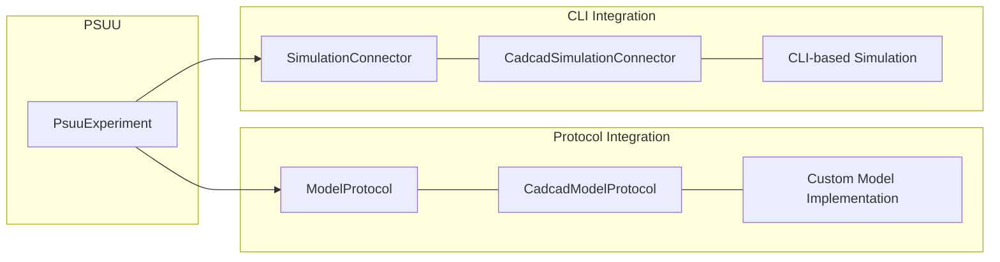
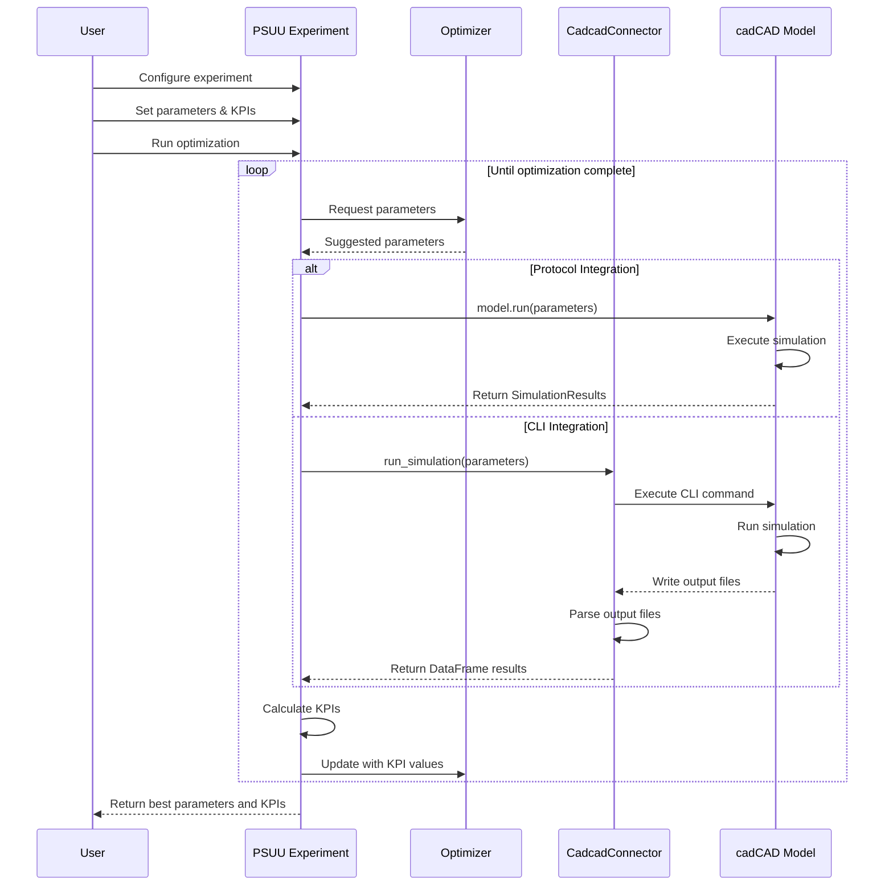

# PSUU - Parameter Selection Under Uncertainty

PSUU is a Python package designed to automate the process of parameter selection and optimization for simulation models under uncertainty, with a focus on cadCAD simulations.

## 📋 Overview

PSUU provides a framework for:
- Interfacing with simulation models via standardized protocols
- Defining custom Key Performance Indicators (KPIs) for evaluation
- Exploring parameter spaces using various optimization algorithms
- Analyzing and visualizing results
- Implementing robust error handling and validation

## ✨ Key Features

- **Standardized Model Protocol**: Define a consistent interface for model integration
- **Flexible Simulation Interface**: Connect to any CLI-based or Python-based simulation model
- **Configuration-Based Integration**: Integration through YAML or JSON configuration files
- **Custom KPI Definitions**: Define your own metrics to optimize for your specific model
- **Multiple Optimization Strategies**: Choose from grid search, random search, Bayesian optimization, and more
- **Robust Error Handling**: Improved error handling and parameter validation
- **Standardized Results Format**: Unified format for simulation results
- **Extensible Architecture**: Easily add new optimization algorithms or KPI calculations
- **Model Template**: Ready-to-use template for creating new cadCAD models

## 🔧 Installation

```bash
pip install psuu
```

For additional features:
```bash
# For Bayesian optimization support
pip install "psuu[bayesian]"

# For visualization features
pip install "psuu[visualization]"

# For cadCAD integration
pip install "psuu[cadcad]"

# For development
pip install "psuu[dev]"
```

## 🚀 Quick Start

### Integration Approaches

PSUU supports two main integration approaches:

1. **Protocol Integration**: Using Python classes implementing ModelProtocol
2. **CLI Integration**: Using command-line interfaces for models

### Python API with CLI Integration

```python
from psuu import PsuuExperiment

# Define experiment with CLI integration
experiment = PsuuExperiment(
    simulation_command="python -m model",
    param_format="--{name} {value}",
    output_format="json"
)

# Define KPIs
experiment.add_kpi("peak_infected", column="infected", operation="max")
experiment.add_kpi("total_infected", column="total", operation="sum")

# Set parameter space
experiment.set_parameter_space({
    "beta": (0.1, 0.5),
    "gamma": (0.01, 0.1)
})

# Configure optimization
experiment.set_optimizer(
    method="bayesian",
    objective_name="peak_infected",
    maximize=False,
    num_iterations=20
)

# Run optimization
results = experiment.run()

# Access results
best_params = results.best_parameters
print(f"Best parameters: {best_params}")
print(f"Best KPIs: {results.best_kpis}")
```

### Using the Model Protocol Integration

```python
from psuu import PsuuExperiment
from template.model import SIRModel  # Using the template model

# Create model instance
model = SIRModel()

# Create experiment with model protocol integration
experiment = PsuuExperiment(model=model)

# Set objective
experiment.set_optimizer(
    method="bayesian",
    objective_name="peak_infected",
    maximize=False,
    num_iterations=20
)

# Run optimization
results = experiment.run()

# Access results
best_params = results.best_parameters
print(f"Best parameters: {best_params}")
print(f"Best KPIs: {results.best_kpis}")
```

### YAML Configuration-Based Integration

```yaml
# config.yaml
model:
  class: "template.model.SIRModel"  # Protocol integration
  protocol: "cadcad"
  
  # Alternatively for CLI integration:
  # entry_point: "python -m template"
  # param_format: "--{name} {value}"
  # output_format: "json"
  
parameters:
  beta:
    type: continuous
    min: 0.1
    max: 0.5
  gamma:
    type: continuous
    min: 0.01
    max: 0.1
  
kpis:
  peak_infected:
    objective: minimize
    description: "Maximum number of infected individuals"
  
optimization:
  algorithm: "bayesian"
  iterations: 30
  initial_points: 5
```

```python
from psuu.config import configure_experiment_from_yaml

# Load configuration and create experiment
experiment = configure_experiment_from_yaml("config.yaml")

# Run optimization
results = experiment.run()
```

### CLI Usage

```bash
# Run optimization with YAML config
python -m psuu --config template/sir_config.yaml

# Or initialize and run manually
psuu init
psuu add-param --name "beta" --range 0.1 0.5
psuu add-kpi --name "peak_infected" --column "infected" --operation "max"
psuu run
```

## 🧠 Core Concepts

Understanding the core concepts of PSUU will help cadCAD users effectively integrate their models with the framework.

### Architecture Overview

PSUU provides a flexible architecture to connect with simulation models:



### Integration Approaches

PSUU offers two main ways to connect with cadCAD models:

1. **Protocol Integration**: Direct connection to Python model classes implementing `ModelProtocol`
   - Preferred for new models or when you have control over the model code
   - Faster and more efficient as it avoids CLI overhead
   - Provides more detailed error information
   - Requires implementing specific interfaces

2. **CLI Integration**: Connection via command-line interface
   - Useful for existing models with established CLI interfaces
   - Allows integration without modifying the original model code
   - Works with models in any language, not just Python
   - More resilient to model crashes



### Core Components

- **PsuuExperiment**: Central class that coordinates the optimization process
- **ModelProtocol**: Abstract base class defining the interface for model integration
- **CadcadModelProtocol**: cadCAD-specific protocol extending the base ModelProtocol
- **SimulationConnector**: Handles running simulations via CLI and parsing results
- **KPICalculator**: Calculates performance metrics from simulation results
- **Optimizers**: Algorithms for exploring the parameter space (Grid, Random, Bayesian, etc.)
- **Configuration**: Utilities for loading and validating experiment configurations

### Parameter Space Definition

Parameters can be defined in several ways:

- **Continuous parameters**: Specified as `(min, max)` tuples
- **Discrete parameters**: Specified as lists of possible values
- **Integer parameters**: Specified as `(min, max)` with integer constraint
- **Categorical parameters**: Specified as lists of possible values (no ordering)

### KPI Definition

Key Performance Indicators (KPIs) are metrics calculated from simulation results:

- **Simple KPIs**: Defined by column name and operation (max, min, mean, sum, etc.)
- **Custom KPIs**: Defined by custom Python functions
- **Objective KPIs**: Selected KPIs targeted for optimization (maximize or minimize)

### Optimization Workflow



For a comprehensive explanation of the architecture with additional diagrams, please see [diagrams.md](diagrams.md).

## 📝 Template Model

PSUU includes a template model in the `template/` directory that demonstrates the recommended structure for cadCAD models to integrate with PSUU. The template follows these principles:

- Separation of model logic, parameters, and KPIs
- Standard output schema via SimulationResults
- Support for both Protocol and CLI integration
- Proper parameter validation

To use the template:

1. Copy the `template/` directory to your project
2. Modify the parameters, logic, and KPIs as needed
3. Update the model class to implement your simulation logic
4. Use either Protocol or CLI integration in your PSUU experiment

See the [template README](template/README-TEMPLATE.md) for more details.

## 📚 Documentation

For more detailed information, check out the following resources:

- [Getting Started](docs/getting_started.md): Basic usage instructions
- [User Guide](docs/user_guide.md): More detailed guidance
- [API Reference](docs/api_reference.md): Detailed API documentation
- [Examples](examples/README.md): Example usage scenarios
- [Integration Guide](docs/integration_guide.md): Guide for integrating models with PSUU
- [Lessons Learned](docs/lessons_learned.md): Insights from implementing the cadCAD integration

## 🧪 Examples

Check out the `examples` directory for comprehensive examples:

- `protocol_example`: Demonstrates the use of the model protocol interface
- `cadcad_integration.py`: Shows how to integrate cadCAD models using the new protocol
- `yaml_configuration.py`: Shows how to use YAML configuration for experiment setup
- `run_template_model.py`: Example script for running the template model with different integration approaches

## 🤝 Contributing

Contributions are welcome! Please feel free to submit a Pull Request.

## 📜 License

MIT
