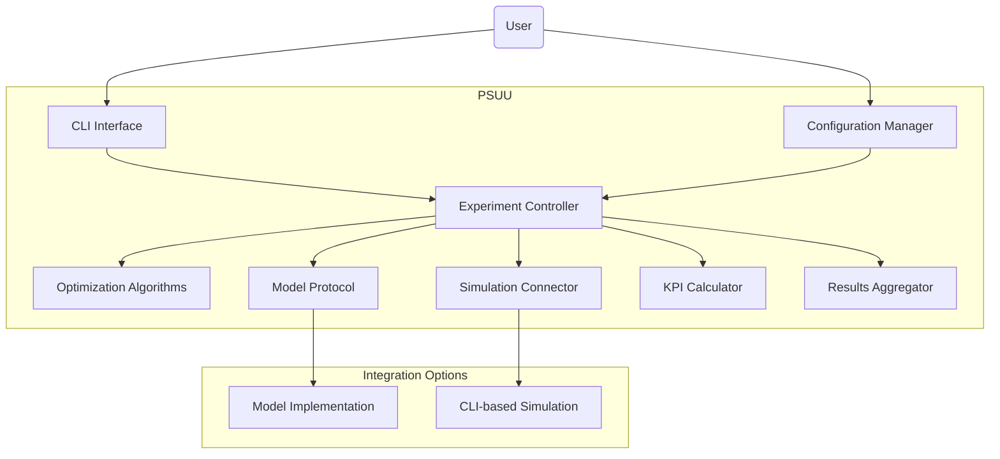
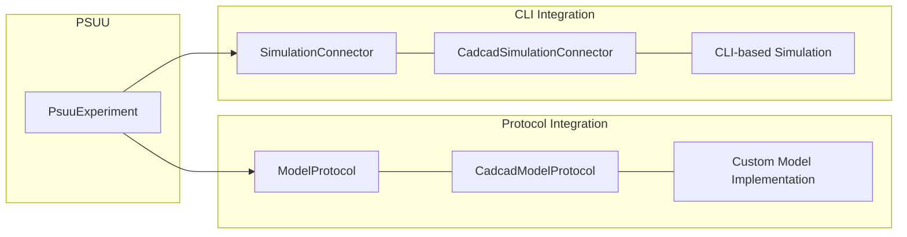
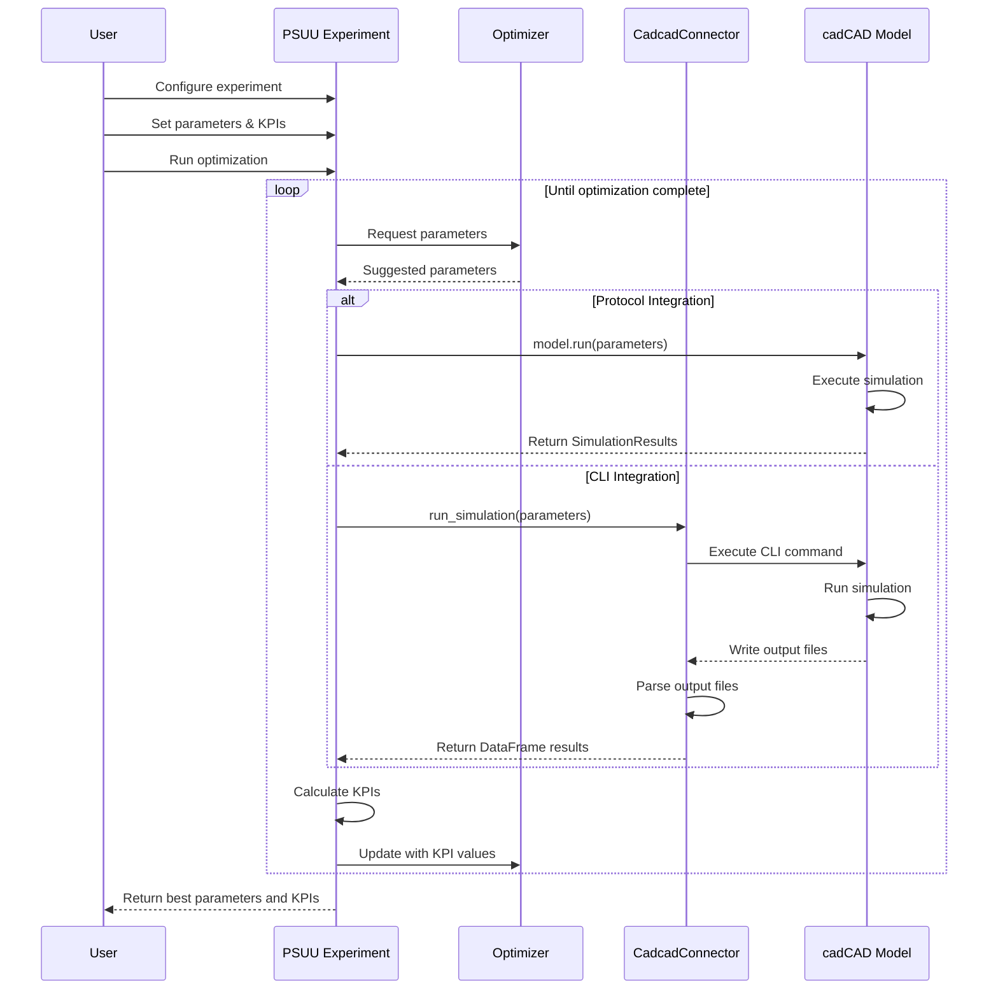
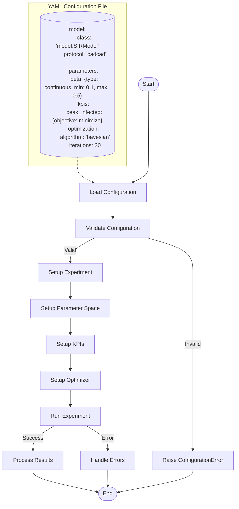
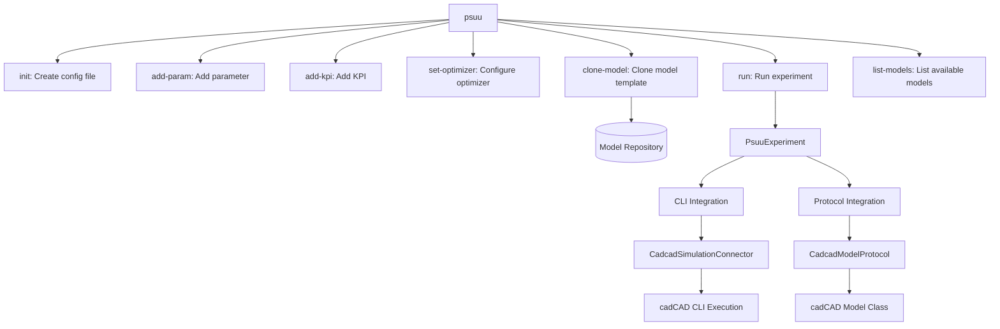
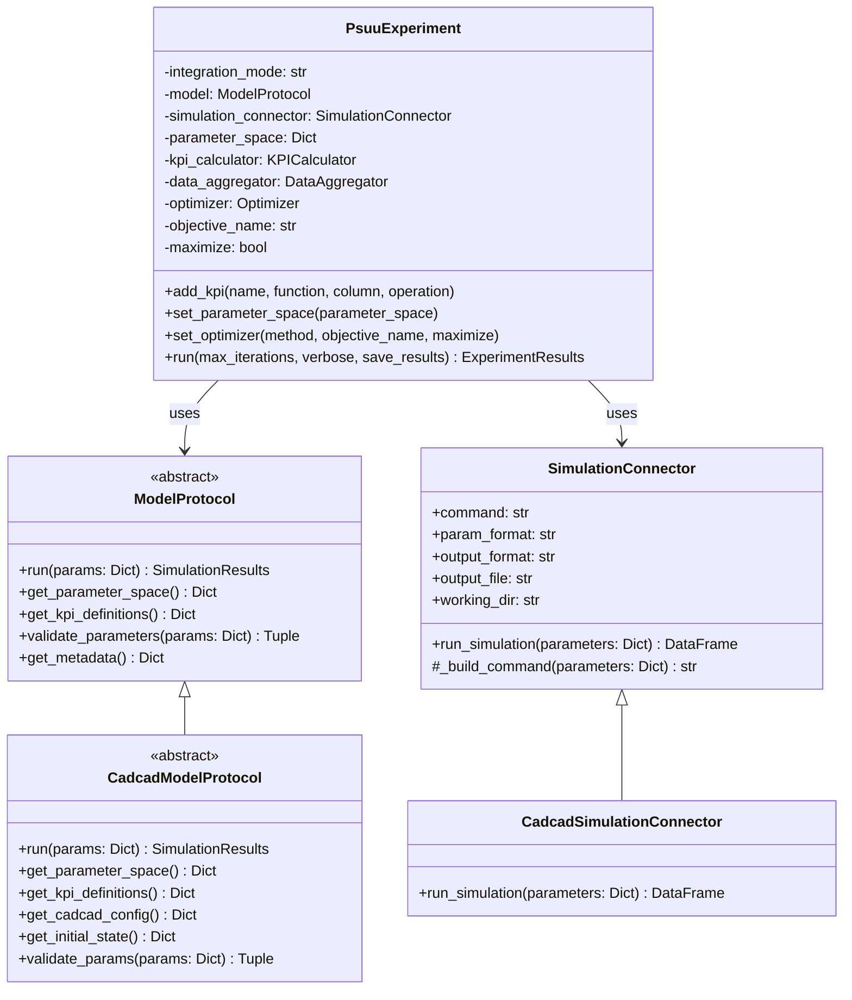
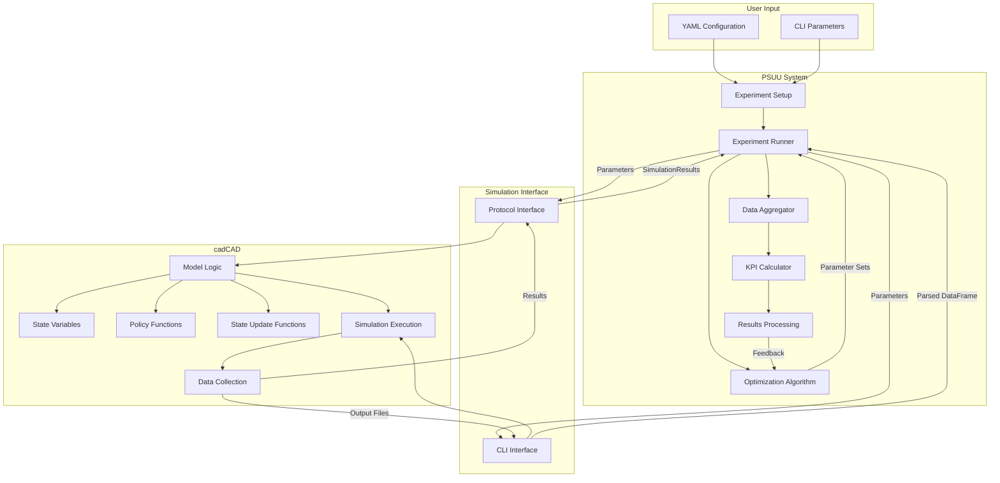

# PSUU Software Architecture Diagrams

This document outlines the architecture of PSUU (Parameter Selection Under Uncertainty) and its integration with cadCAD using Mermaid diagrams.

## Table of Contents

1. [Overview: PSUU Architecture](#overview-psuu-architecture)
2. [Integration Patterns: Protocol vs CLI](#integration-patterns)
3. [PSUU-cadCAD Integration Flow](#psuu-cadcad-integration-flow)
4. [Configuration and Experiment Workflow](#configuration-and-experiment-workflow)
5. [Command Line Interface Structure](#command-line-interface-structure)

## Overview: PSUU Architecture

## Integration Patterns

PSUU provides two main ways to connect with simulation models:

## PSUU-cadCAD Integration Flow

## Configuration and Experiment Workflow

## Command Line Interface Structure

## Class Structure for Model Protocol

## Data Flow for cadCAD Integration

